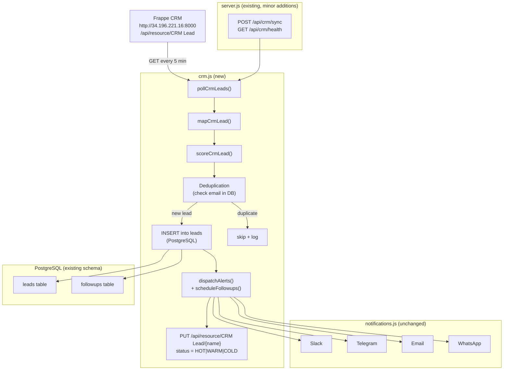

# Design Document: CRM Integration

## Overview

This design adds a CRM polling layer to the existing LeadFlow AI system. The existing Express server, PostgreSQL database, scoring logic, and notification pipeline remain unchanged. A new `crm.js` module is introduced that:

1. Fetches `CRM Lead` records from the Frappe REST API on a 5-minute schedule
2. Maps CRM fields to the internal lead schema
3. Scores and classifies each lead using a CRM-aware scoring function
4. Stores new leads in PostgreSQL (deduplicating by email)
5. Calls the existing `dispatchAlerts` and `scheduleFollowups` functions
6. Writes the computed status back to the CRM via a `PUT` request

Two new Express routes are added: `POST /api/crm/sync` (manual trigger) and `GET /api/crm/health` (connectivity check).

---

## Architecture



---

## Components and Interfaces

### `crm.js` — New Module

**Exports:**
```js
pollCrmLeads(pool)          // → { processed, skipped, errors }
checkCrmHealth()            // → { ok: bool, message: string }
mapCrmLead(crmRecord)       // → internal lead object
scoreCrmLead(crmRecord)     // → { score: number, lead_status: string }
```

**Environment variables consumed:**
| Variable | Purpose |
|---|---|
| `CRM_BASE_URL` | Base URL of the Frappe CRM, e.g. `http://34.196.221.16:8000` |
| `CRM_SID` | Frappe session cookie value |

### `server.js` — Additions Only

Two new routes wired to `crm.js` functions:
- `POST /api/crm/sync` → calls `pollCrmLeads(pool)`, returns result JSON
- `GET /api/crm/health` → calls `checkCrmHealth()`, returns status JSON

The existing 5-minute `setInterval` is extended to also call `pollCrmLeads(pool)`.

---

## Data Models

### CRM Lead (Frappe API response shape)
```json
{
  "name": "CRM-LEAD-2025-00004",
  "lead_name": "Rahul Sharma",
  "email_id": "rahul@example.com",
  "mobile_no": "9876543210",
  "status": "New",
  "organization": "TechCorp",
  "source": "Website",
  "notes": "Interested in AI products"
}
```

### Field Mapping: CRM → Internal
| CRM Field | Internal Field | Notes |
|---|---|---|
| `name` | `crm_id` | stored for write-back reference |
| `lead_name` | `name` | required |
| `email_id` | `email` | required, dedup key |
| `mobile_no` | `phone` | optional |
| `organization` | `company` | optional |
| `source` | `industry` | optional |
| `notes` | `notes` | optional |
| _(computed)_ | `role` | set to `"CRM Import"` |
| _(computed)_ | `product` | set to `organization` value |

### CRM Scoring Rules
| Condition | Points |
|---|---|
| `status === "Interested"` | +4 |
| `status === "Replied"` | +3 |
| `status === "New"` | +1 |
| `source` is non-empty | +1 |
| `organization` is non-empty | +1 |

Classification thresholds (same as existing):
- score ≥ 7 → `HOT`
- score ≥ 3 → `WARM`
- score < 3 → `COLD`

---

## Correctness Properties

*A property is a characteristic or behavior that should hold true across all valid executions of a system — essentially, a formal statement about what the system should do. Properties serve as the bridge between human-readable specifications and machine-verifiable correctness guarantees.*

### Property 1: Field mapping completeness
*For any* valid CRM lead record, `mapCrmLead()` should produce an internal lead object where `name === lead_name`, `email === email_id`, `phone === mobile_no`, `company === organization`, `industry === source`, and `notes === notes`.
**Validates: Requirements 3.1, 3.2, 3.3, 3.4, 3.5, 3.6**

### Property 2: Scoring determinism
*For any* CRM lead record, `scoreCrmLead()` should return the same score and classification on every call (pure function, no side effects). The score should equal the sum of points from the scoring rules table, and the classification should match the threshold rules.
**Validates: Requirements 4.1, 4.2**

### Property 3: Score-to-classification monotonicity
*For any* two CRM lead records A and B where `score(A) >= score(B)`, the classification of A should be at least as high priority as B (HOT ≥ WARM ≥ COLD).
**Validates: Requirements 4.2**

### Property 4: Deduplication invariant
*For any* CRM lead whose `email_id` already exists in the local database, calling `pollCrmLeads()` should not increase the total row count in the `leads` table and should not call `dispatchAlerts`.
**Validates: Requirements 3.7**

### Property 5: Dispatch pipeline completeness
*For any* new CRM lead successfully stored in the database, the processing pipeline should call `dispatchAlerts` with the mapped lead object and `scheduleFollowups` with the same lead — and the `products` argument to `dispatchAlerts` should equal the CRM `organization` field.
**Validates: Requirements 5.1, 5.2, 5.4**

### Property 6: CRM write-back correctness
*For any* CRM lead processed by `pollCrmLeads()`, a `PUT` request should be made to `/api/resource/CRM Lead/{name}` with a body containing `status` equal to the computed `lead_status` (HOT, WARM, or COLD).
**Validates: Requirements 6.1, 6.3**

### Property 7: Sync response shape
*For any* invocation of `POST /api/crm/sync`, the response JSON should contain exactly the keys `processed`, `skipped`, and `errors`, all with non-negative integer values, and `processed + skipped + errors` should equal the total number of CRM records fetched.
**Validates: Requirements 7.2**

---

## Error Handling

| Scenario | Behaviour |
|---|---|
| `CRM_BASE_URL` or `CRM_SID` not set | Log warning, skip polling cycle, return early |
| CRM API returns 401/403 | Log auth error, skip cycle |
| CRM API network timeout/error | Log error, increment `errors` counter, continue |
| CRM record missing `lead_name` or `email_id` | Log warning, skip record, increment `skipped` |
| Duplicate email in local DB | Skip silently, increment `skipped` |
| CRM write-back PUT fails | Log error, continue processing next lead |
| Local DB insert fails | Log error, increment `errors`, skip notifications for that lead |

---

## Testing Strategy

### Dual Testing Approach

Both unit tests and property-based tests are used — they are complementary:
- **Unit tests** verify specific examples, edge cases, and error conditions
- **Property tests** verify universal properties hold across all generated inputs

### Property-Based Testing Library

**Library:** [fast-check](https://github.com/dubzzz/fast-check) (JavaScript/Node.js)

Install: `npm install --save-dev fast-check`

Each property test runs a minimum of **100 iterations**.

**Tag format:** `// Feature: crm-integration, Property N: <property_text>`

### Test File Structure

```
tests/
  crm.unit.test.js      ← unit tests (Jest)
  crm.pbt.test.js       ← property-based tests (Jest + fast-check)
```

### Unit Test Coverage

- `mapCrmLead()` with a known CRM record → verify exact field values
- `scoreCrmLead()` with status="Interested" + source + org → expect score=6, WARM
- `scoreCrmLead()` with status="Interested" + source + org + extra → expect HOT
- `checkCrmHealth()` when env vars missing → expect `{ ok: false }`
- `POST /api/crm/sync` with no CRM config → expect HTTP 503
- `GET /api/crm/health` with mocked successful CRM → expect `{ status: "ok" }`
- Deduplication: inserting same email twice → second call skipped
- Missing `email_id` in CRM record → record skipped

### Property Test Coverage

Each property from the Correctness Properties section maps to exactly one property-based test:

| Property | Test | Generator |
|---|---|---|
| P1: Field mapping completeness | `crm.pbt.test.js` | Arbitrary CRM lead objects with random string fields |
| P2: Scoring determinism | `crm.pbt.test.js` | Arbitrary CRM lead objects |
| P3: Score monotonicity | `crm.pbt.test.js` | Pairs of CRM leads with varying status/source/org |
| P4: Deduplication invariant | `crm.pbt.test.js` | Arbitrary leads + pre-seeded DB state |
| P5: Dispatch pipeline completeness | `crm.pbt.test.js` | Arbitrary new CRM leads (mock DB + dispatch) |
| P6: CRM write-back correctness | `crm.pbt.test.js` | Arbitrary CRM leads (mock HTTP client) |
| P7: Sync response shape | `crm.pbt.test.js` | Arbitrary batches of CRM records (mix of new/duplicate/invalid) |
