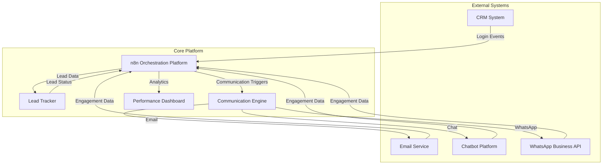

# Design Document: Lead Nurturing Automation

## Overview

The Lead Nurturing Automation system transforms product usage data into structured lead conversion workflows using n8n as the orchestration platform. The system captures product login events from CRM systems, treats them as buying intent signals, and manages leads through a multi-stage nurturing process using email, chatbot, and WhatsApp communications.

The architecture follows a microservices approach with n8n workflows coordinating between external systems: CRM (read-only data source), Lead Tracker (external lead management), and Communication Engine (multi-channel messaging). This design ensures the CRM remains unmodified while enabling sophisticated lead nurturing capabilities.

## Architecture

### System Components



### Data Flow Architecture

The system operates through event-driven workflows:

1. **Data Ingestion**: n8n polls CRM for new login events or receives webhook notifications
2. **Lead Processing**: Login events trigger lead creation/update in Lead Tracker
3. **Workflow Routing**: Product-specific workflows determine nurturing sequences
4. **Communication Delivery**: Multi-channel messages sent based on lead stage and preferences
5. **Engagement Tracking**: Response data feeds back into lead scoring and stage progression
6. **Analytics Generation**: Performance metrics calculated from lead progression data

### Technology Stack

- **Orchestration**: n8n (self-hosted or cloud)
- **Lead Storage**: PostgreSQL or MongoDB for Lead Tracker
- **Communication APIs**: 
  - Email: SendGrid, Mailgun, or SMTP
  - WhatsApp: WhatsApp Business API or Twilio
  - Chatbot: Custom webhook integration or platform APIs
- **Analytics**: Built-in n8n monitoring + custom dashboard
- **CRM Integration**: REST APIs or database connections (read-only)

## Components and Interfaces

### n8n Workflow Architecture

**Core Workflows:**

1. **CRM Data Ingestion Workflow**
   - Trigger: Scheduled polling or webhook
   - Nodes: CRM API call → Data transformation → Lead Tracker update
   - Error handling: Retry logic, dead letter queue for failed records

2. **Lead Stage Management Workflow**
   - Trigger: Lead Tracker events or engagement data
   - Nodes: Score calculation → Stage evaluation → Workflow routing
   - Business rules: Configurable thresholds and progression criteria

3. **Product-Specific Nurturing Workflows**
   - Trigger: New lead assignment or stage progression
   - Nodes: Content selection → Channel routing → Message delivery
   - Personalization: Product-specific templates and sequences

4. **Engagement Processing Workflow**
   - Trigger: Communication platform webhooks
   - Nodes: Event parsing → Score update → Re-engagement logic
   - Analytics: Engagement metrics calculation and storage

### Lead Tracker Component

**Core Functions:**
- Lead lifecycle management (CRUD operations)
- Stage progression tracking with audit trails
- Engagement score calculation and storage
- Lead deduplication and conflict resolution

**API Interface:**
```
POST /leads - Create new lead
PUT /leads/{id} - Update lead information
GET /leads/{id} - Retrieve lead details
POST /leads/{id}/events - Record engagement event
GET /leads/{id}/score - Get current engagement score
POST /leads/{id}/stage - Update lead stage
```

**Database Schema:**
- Leads table: Core lead information and current state
- Lead_Events table: Engagement history and audit trail
- Lead_Scores table: Historical scoring data
- Product_Configs table: Product-specific nurturing rules

### Communication Engine Component

**Channel Abstraction:**
The Communication Engine provides a unified interface for multi-channel messaging while maintaining channel-specific optimizations.

**Core Functions:**
- Message template management per product and channel
- Delivery scheduling and rate limiting
- Engagement tracking and webhook processing
- Channel preference management

**API Interface:**
```
POST /messages/send - Send message via specified channel
GET /messages/{id}/status - Check delivery status
POST /templates - Create/update message templates
GET /engagement/{lead_id} - Retrieve engagement metrics
```

**Channel Implementations:**
- **Email**: Template-based HTML/text emails with tracking pixels
- **WhatsApp**: Rich media messages with quick reply buttons
- **Chatbot**: Conversational flows with lead qualification logic

## Data Models

### Lead Data Model

```typescript
interface Lead {
  id: string;
  crm_user_id: string;
  organization_id: string;
  product_id: string;
  stage: 'User' | 'Engaged_Lead' | 'Qualified_Lead' | 'Customer';
  engagement_score: number;
  created_at: Date;
  updated_at: Date;
  last_login_at: Date;
  contact_info: {
    email: string;
    phone?: string;
    preferred_channel: 'email' | 'whatsapp' | 'chatbot';
  };
  demographics: {
    job_title?: string;
    company_size?: string;
    industry?: string;
  };
  product_context: {
    login_frequency: number;
    feature_usage: string[];
    trial_status?: string;
  };
}
```

### Engagement Event Model

```typescript
interface EngagementEvent {
  id: string;
  lead_id: string;
  event_type: 'email_open' | 'email_click' | 'whatsapp_reply' | 'chatbot_interaction' | 'login';
  channel: 'email' | 'whatsapp' | 'chatbot' | 'product';
  timestamp: Date;
  metadata: {
    message_id?: string;
    content_type?: string;
    response_data?: any;
  };
  score_impact: number;
}
```

### Product Configuration Model

```typescript
interface ProductConfig {
  product_id: string;
  name: string;
  nurturing_sequences: {
    stage: string;
    messages: Array<{
      delay_hours: number;
      channel: string;
      template_id: string;
      conditions?: any;
    }>;
  }[];
  scoring_rules: {
    login_points: number;
    email_engagement_multiplier: number;
    qualification_threshold: number;
  };
  conversion_goals: string[];
}
```

### n8n Workflow Configuration

**Workflow Templates:**
Each product requires standardized n8n workflows with configurable parameters:

- **Data Source Configuration**: CRM connection details and polling intervals
- **Scoring Parameters**: Point values for different engagement types
- **Communication Templates**: Channel-specific message content
- **Progression Rules**: Thresholds for stage advancement
- **Error Handling**: Retry policies and notification settings

**Workflow Versioning:**
n8n workflows support versioning to enable:
- A/B testing of nurturing sequences
- Rollback capabilities for problematic deployments
- Performance comparison between workflow versions
- Gradual rollout of workflow improvements

## Correctness Properties

*A property is a characteristic or behavior that should hold true across all valid executions of a system—essentially, a formal statement about what the system should do. Properties serve as the bridge between human-readable specifications and machine-verifiable correctness guarantees.*

### Property 1: Complete Data Ingestion
*For any* product login event in the CRM, the system should capture the event with complete user details, organization information, product identification, and timestamp without modifying the source CRM data.
**Validates: Requirements 1.1, 1.2, 1.3, 1.5**

### Property 2: Lead Stage Lifecycle Management
*For any* lead progression through the system, stage transitions should follow the defined sequence (User → Engaged Lead → Qualified Lead → Customer) with proper audit trails, timestamps, and trigger appropriate follow-up actions.
**Validates: Requirements 2.1, 2.2, 2.3, 2.4, 2.5, 2.6**

### Property 3: Product-Specific Workflow Routing
*For any* lead created from a product login, the system should assign the lead to the correct product-specific workflow and maintain separate pipelines while handling cross-product scenarios appropriately.
**Validates: Requirements 3.1, 3.2, 3.3, 3.4, 3.5**

### Property 4: Multi-Channel Communication Delivery
*For any* qualified lead requiring communication, the system should deliver messages through the appropriate channels (email, chatbot, WhatsApp) while respecting user preferences and tracking delivery status.
**Validates: Requirements 4.1, 4.2, 4.3, 4.4, 4.5**

### Property 5: Engagement Processing and Scoring
*For any* lead interaction with communications, the system should record the engagement event, update engagement scores, and trigger qualification workflows when thresholds are reached.
**Validates: Requirements 5.1, 5.2, 5.3, 5.4, 5.5**

### Property 6: n8n Platform Orchestration
*For any* system operation, n8n should properly orchestrate CRM data retrieval, lead management, communication delivery, error handling, and maintain comprehensive audit trails.
**Validates: Requirements 6.1, 6.2, 6.3, 6.4, 6.5, 6.6**

### Property 7: Data Independence and Consistency
*For any* lead data operation, the Lead Tracker should maintain data independently from the CRM while ensuring consistency, handling synchronization, providing API access, and resolving conflicts appropriately.
**Validates: Requirements 7.1, 7.2, 7.3, 7.4, 7.5**

### Property 8: Comprehensive Analytics and Reporting
*For any* system activity, conversion tracking, performance metrics, and analytics should be properly calculated, attributed, and made available through dashboards and standard export formats.
**Validates: Requirements 8.1, 8.2, 8.3, 8.4, 8.5**

### Property 9: Product Pipeline Isolation
*For any* two different products, their respective lead nurturing pipelines should operate independently without interference, ensuring product-specific configurations and sequences are maintained separately.
**Validates: Requirements 3.3**

### Property 10: CRM Read-Only Integrity
*For any* CRM interaction, the system should never modify existing CRM records, ensuring the CRM remains in its original state after all system operations.
**Validates: Requirements 1.3**

## Error Handling

### Error Categories and Strategies

**1. CRM Integration Errors**
- **Connection Failures**: Implement exponential backoff retry with circuit breaker pattern
- **Data Format Issues**: Validate and sanitize CRM data with fallback to manual review queue
- **Rate Limiting**: Implement request throttling and queue management
- **Authentication Errors**: Automatic token refresh with alert notifications

**2. Communication Delivery Errors**
- **Channel Failures**: Automatic failover to alternative channels based on preferences
- **Rate Limiting**: Implement per-channel rate limiting with queue management
- **Content Errors**: Template validation and fallback to default content
- **Delivery Failures**: Retry logic with exponential backoff and dead letter queues

**3. Lead Processing Errors**
- **Duplicate Detection**: Implement lead deduplication with conflict resolution rules
- **Scoring Calculation Errors**: Fallback to default scores with manual review flags
- **Stage Transition Errors**: Rollback mechanisms with audit trail preservation
- **Data Validation Errors**: Quarantine invalid records for manual review

**4. n8n Workflow Errors**
- **Execution Failures**: Automatic retry with configurable limits and escalation
- **Memory/Timeout Issues**: Workflow optimization and resource monitoring
- **Dependency Failures**: Health checks and graceful degradation
- **Version Conflicts**: Rollback capabilities and version management

### Error Recovery Mechanisms

**Dead Letter Queues**: Failed operations are queued for manual review and reprocessing
**Circuit Breakers**: Prevent cascade failures by temporarily disabling failing components
**Graceful Degradation**: Core functionality continues even when non-critical components fail
**Audit Logging**: Comprehensive error logging for debugging and compliance
**Alert Systems**: Real-time notifications for critical errors requiring immediate attention

## Testing Strategy

### Dual Testing Approach

The system requires both unit testing and property-based testing to ensure comprehensive coverage:

**Unit Tests** focus on:
- Specific examples demonstrating correct behavior
- Integration points between n8n workflows and external systems
- Edge cases like empty CRM responses, malformed data, and network failures
- Error conditions and recovery mechanisms
- API endpoint functionality and response validation

**Property-Based Tests** focus on:
- Universal properties that hold across all inputs and scenarios
- Comprehensive input coverage through randomized test data generation
- Lead lifecycle correctness across different product configurations
- Data consistency and integrity across system operations
- Communication delivery reliability across all channels

### Property-Based Testing Configuration

**Testing Framework**: Use fast-check (JavaScript/TypeScript) or Hypothesis (Python) for property-based testing
**Test Iterations**: Minimum 100 iterations per property test to ensure statistical confidence
**Test Tagging**: Each property test must reference its design document property using the format:
- **Feature: lead-nurturing-automation, Property 1: Complete Data Ingestion**
- **Feature: lead-nurturing-automation, Property 2: Lead Stage Lifecycle Management**

### Integration Testing Strategy

**n8n Workflow Testing**:
- Mock external services (CRM, email, WhatsApp) for isolated workflow testing
- End-to-end testing with test CRM data and sandbox communication channels
- Performance testing under load with multiple concurrent leads
- Failure scenario testing with simulated service outages

**API Testing**:
- Contract testing between n8n workflows and Lead Tracker APIs
- Load testing for high-volume lead processing scenarios
- Security testing for API authentication and authorization
- Data validation testing for malformed inputs and edge cases

**Communication Channel Testing**:
- Template rendering validation across all channels
- Delivery confirmation and engagement tracking verification
- Rate limiting and queue management testing
- Channel failover and preference handling validation

### Performance and Scalability Testing

**Load Testing Scenarios**:
- High-volume CRM data ingestion (1000+ login events per minute)
- Concurrent multi-channel communication delivery
- Large-scale engagement event processing
- Analytics calculation under heavy data loads

**Monitoring and Alerting**:
- n8n workflow execution time and success rates
- Lead processing throughput and queue depths
- Communication delivery rates and engagement metrics
- System resource utilization and performance bottlenecks